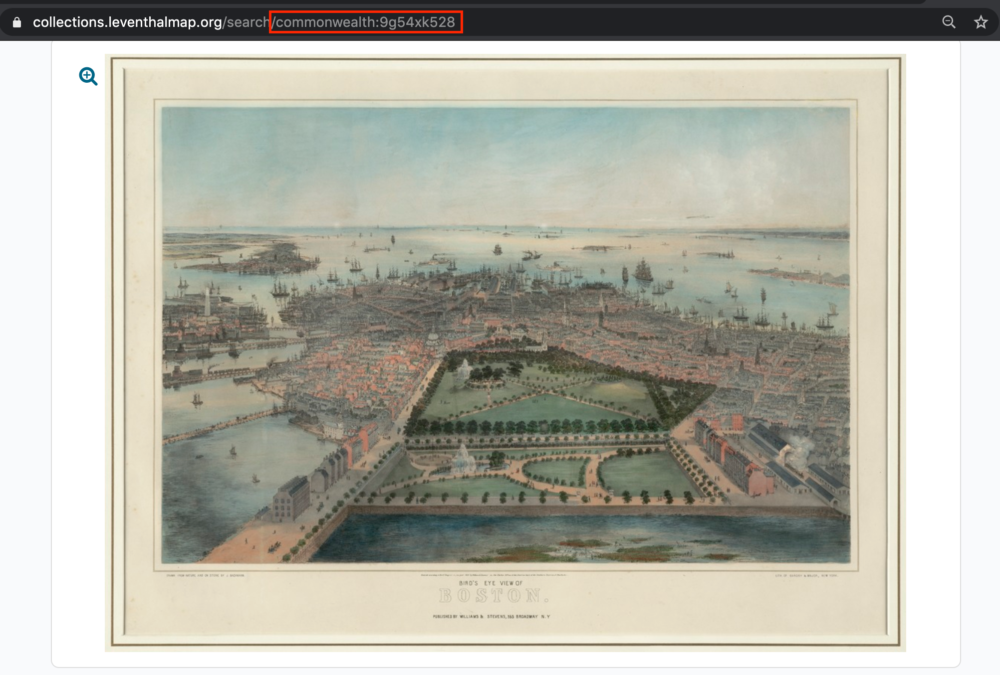
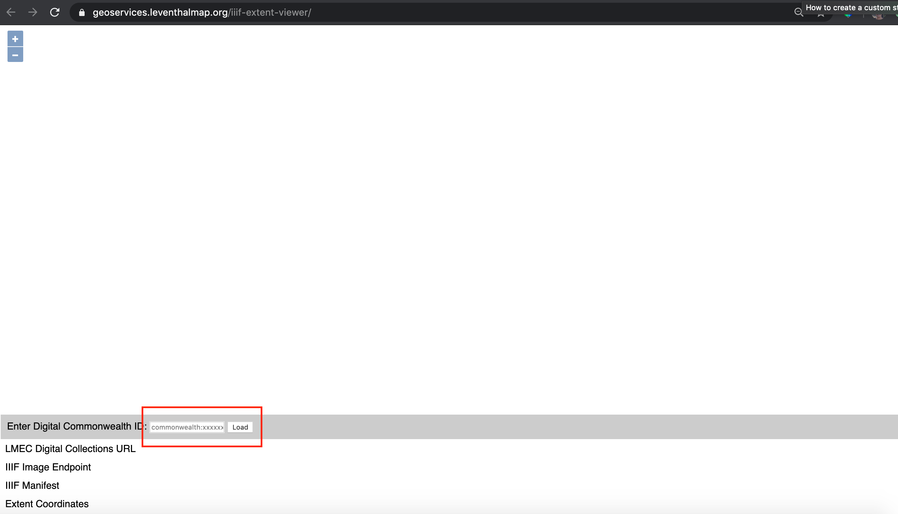
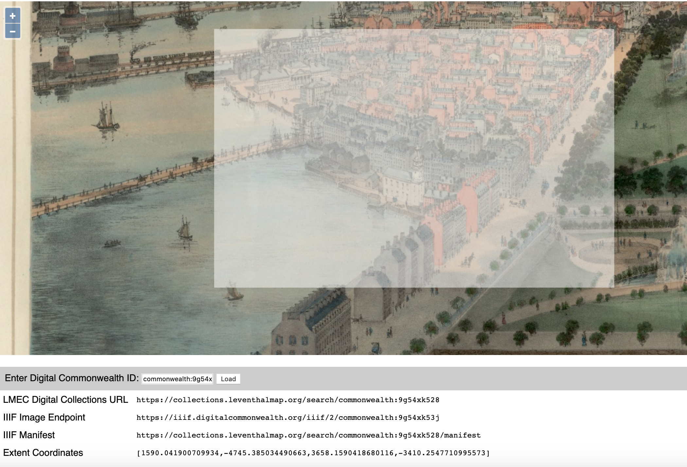

# Creating an Annotated Map Story

**Annotated Map Stories** are a web tool created by the LMEC for adding captions and annotating zoomed-in sections of maps in the digital collections, or any photos, manuscripts or other digital records in the BPL Digital Commonwealth.

Annotated Map Stories are useful for exploring the fine-tuned details of primary source documents, and presenting information about them, without having to download the images.

## Examples

Here are some examples, made by staff at the Map Center, which are embedded into this guide to show how the tool works. You can click the link below each story to find the full screen version.

### Building the Tremont Street Subway

<iframe src="https://geoservices.leventhalmap.org/map-stories/#tremont-subway/"  width="100%" height="500px" title="Building the Tremont Street Subway"></iframe>

[Building the Tremont Street Subway](https://geoservices.leventhalmap.org/map-stories/#tremont-subway/) 

### Land of the Mashpee

<iframe src="https://geoservices.leventhalmap.org/map-stories/#mashpee-map/"  width="100%" height="500px" title="Land of the Mashpee"></iframe>

[Land of the Mashpee](https://geoservices.leventhalmap.org/map-stories/#mashpee-map/).

## What you will need

1. A browser tab open to our [Digital Collections portal](https://collections.leventhalmap.org/ "Digital Collections portal") and/or [Digital Commonwealth](https://www.digitalcommonwealth.org/ "Digital Commonwealth")   
2. A browser tab open to the [IIIF Extent Viewer tool](https://geoservices.leventhalmap.org/iiif-extent-viewer/ "IIIF Extent Viewer tool")    
3. A Google Sheet; make a copy of [this template](https://docs.google.com/spreadsheets/d/1oe9omQd62_WSQiV7o8WOZPawB2oNEwabAmrOxYTs0gE/edit?usp=sharing "this template"). Each row is a "stop" on the tour, and consists of:
    * Information about what object to show (the `id`, `sequence`, and `repo` columns)
    * What zoomed-in section of the object to show (the `extent` column)
    * Descriptive text in the form of a header and caption (the `caption-header` and `caption-text` columns)
4. A browser tab open to the [Map Story Generator](https://geoservices.leventhalmap.org/map-story-generator/) tool, for previewing and publishing your map when it's complete.

::: tip What is IIIF?
**IIIF** is an acronym for the International Image Interoperability Framework. It's an image delivery protocol which allows for zoomable, high-resolution images to be served over the Web. Our Digital Collections server provides imagery using IIIF.
:::

## Steps

### Select a first object from Digital Collections

1. Using the Digital Collections search tool, navigate to the record page for the first map you want to use 
2. You’ll need to copy the part of the URL in your browser that looks like `commonwealth:abc123xyz`

3. Go to your spreadsheet, and in the first row, in the `id` column, paste that same string. 
4. For items in the LMEC digital collections, the `repo` column should be **lmec**. For items in Digital Commonwealth, the `repo` column should be **dc**. 

::: warning About the repo column
Even if you mess up the `repo` column, the object will still display. This column is only used to control whether the browser opens LMEC Digital Collections or Digital Commonwealth when the user clicks the **Collections page for this item** button. 
:::

5. As of now, you should enter the number 0 in the sequence column, for every row. 

::: warning About the sequence column
This is a placeholder for a future improvement which will allow us to work with multi-image objects. Right now, only single-image objects can be used.
:::

### Decide which zoom of the object to show

1. If you want to show the entire object, enter the word fit in the `extent` column of the row you created
2. If you want this stop on the storyline to show a zoomed in section of the object, go to the [IIIF Extent Viewer](https://geoservices.leventhalmap.org/iiif-extent-viewer/) in another tab.  
3. Paste the `id` string for your map into the “Enter Digital Commonwealth ID” field of the Extent Viewer, and click “Load” 

4. You should see the map pop up in this viewer. Hold Shift and drag around an area which you’d like to annotate in the next “step” of your map storyline. 

::: tip
The story viewer will automatically give you a bit of buffer on the bottom edge  of the extent to account for overlap the caption box, but you should still give a generous margin on the bottom side of your area.
::: 

5. If you need to adjust the extent selection box, shift and drag on one of its edges, or shift and drag in a new part of the image.

6. Copy the bracketed set of numbers in the table under “Extent Coordinates” (including the brackets themselves).
7. Paste this string, *with* the brackets, into the `extent` column of your spreadsheet.

### Add more rows to your spreadsheet

Every row in the spreadsheet becomes a "stop" in the story. To continue narrating your story, add a second row to the spreadsheet. If you use the same `id` but a new `extent`, the next stop will be the same object zoomed to this new extent. If you use a new id, you’ll be jumping over to a new object. 

### Preview and publish 

#### Publishing for the first time

1. The “Map Story Generator” tool creates a map storyline from your spreadsheet. [Open it](https://geoservices.leventhalmap.org/map-story-generator/) in a new browser window or tab.
2. Back in your spreadsheet, select the “Share” button, make sure that Link Sharing is “on,” and then copy the shareable link.
3. In the Map Story Generator tool, paste the shared link to your Google Sheet in the first box.
4. In the second box, “Tour Identifier,” choose an identifier for your story. This will become part of your tour’s URL, and it shouldn’t have spaces. For instance, if you choose `boston-public-garden` as your identifier, the final story will have the URL `https://geoservices.leventhalmap.org/map-stories/#boston-public-garden`. 

::: warning Reusing identifiers

If you choose the same identifier as an existing story, running this tool will *update* the story rather than creating a new one. This is how you edit an existing story. 

:::

5. In the third and fourth boxes, type the name of your story and the author name. 
6. Click the “Generate” button, and, if everything goes correctly, you should get a map story URL created for you. Click it to see how things look!

#### Editing an existing story

There is no automatic relationship between your spreadsheet and the story. When you click the "Generate tour" button on the Map Story Generator, it copies data from your spreadsheet into the tours data storage. Because of this, if you edit or delete your spreadsheet, nothing will change automatically.

To edit your story, make the necessary changes in your spreadsheet. Then, return to the Map Story Generator tool, and enter the same information as if you were going to publish for the first time, but use the *same* identifier as the story you want to edit. This will overwrite the existing story data for that tour.

#### Deleting a story

There's currently no user-accessible way to delete a story. Contact Garrett, Map Center Curator and author of this tool (gnelson@leventhalmap.org) if you need to delete a story entirely.
