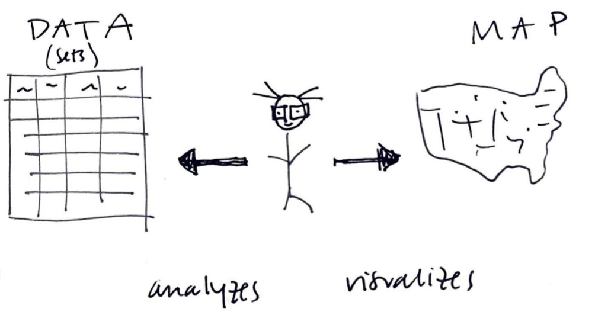
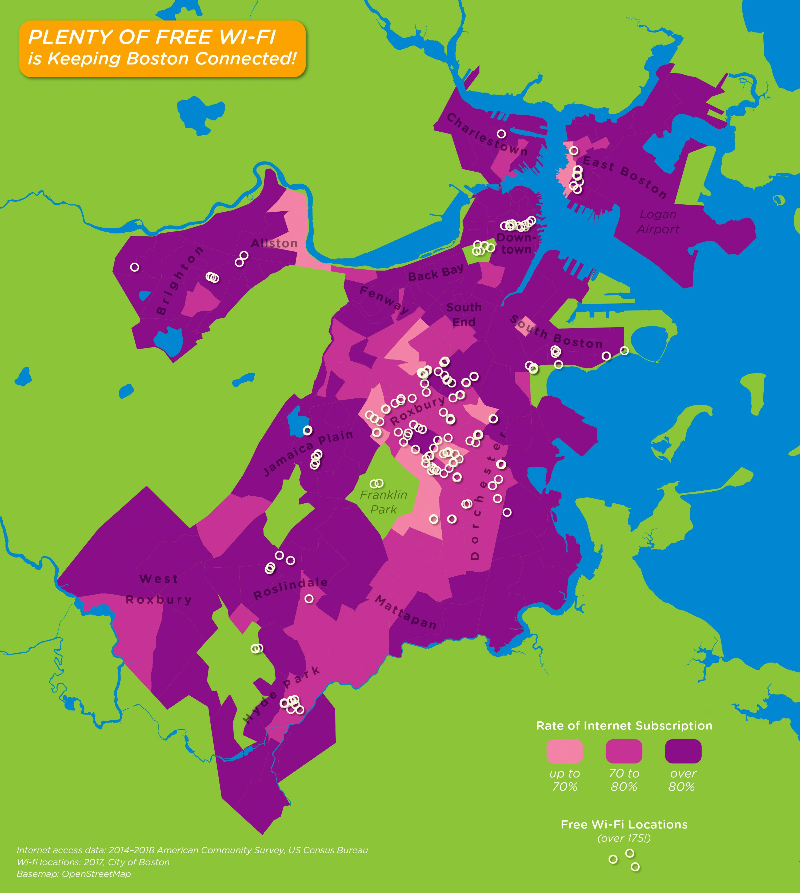
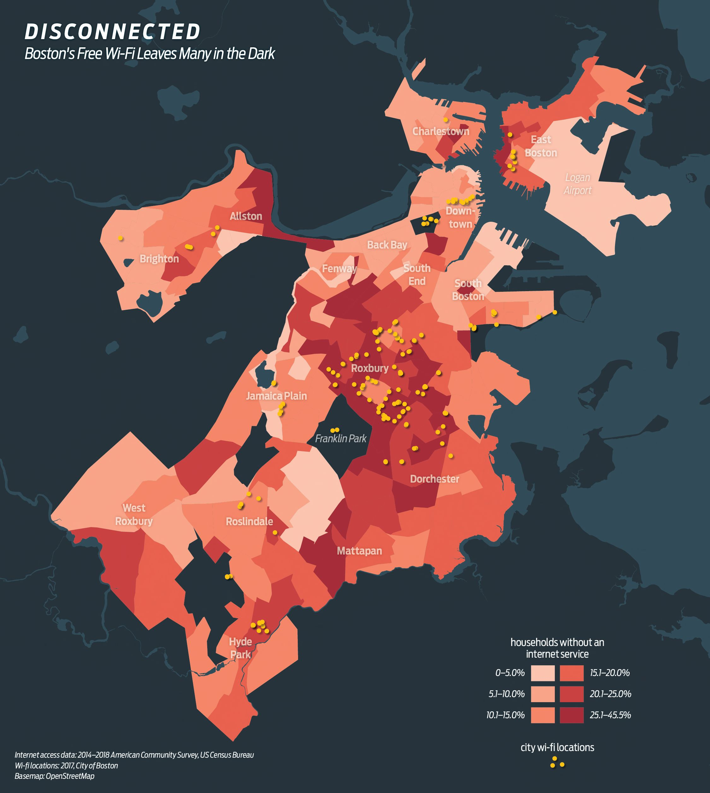
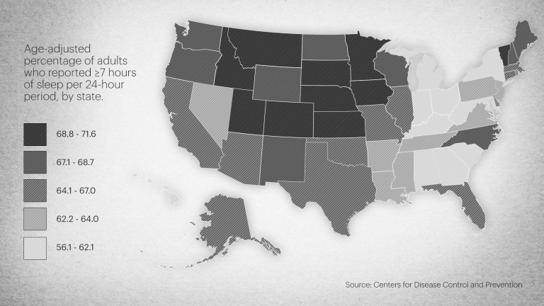

# The human role in mapping: from data to maps

## In between data and maps are people.

<figure>

<figcaption>

An illustration of the human role in data analysis, Tess McCann (2021).

</figcaption>
</figure>

* Data can never become a map all by itself.
* Any given dataset could produce many different maps.
* **Cartographers** have power over how we see data.
* It's important to look at the data behind the map; how did the cartographer analyze and (mis)represent the data?
* What kind of arguments do each of these maps make? What do you, as the mapreader, take away from each map?

<figure>

<figcaption>

"Plenty of free wi-fi is keeping Boston connected!" [Map](https://collections.leventhalmap.org/search/commonwealth:3x817734d) by Daniel Huffman, 2020.

</figcaption>
<figure>

<figure>

<figcatpion>
"Disconnected : Boston's free wi-fi leaves many in the dark" [Map](https://collections.leventhalmap.org/search/commonwealth:3x817744n) by Daniel Huffman, 2020.

</figcaption>
</figure>

<hideable title = "More reading on a cartographer's choices">

Let's look at the dataset behind these maps, which is available on the LMEC Public Data Portal.

<figure>

<figcaption>

LMEC Boston Public Internet Access Data File

</figcaption>
</figure>

It might be hard to imagine how this data might become a map. It's the job of a **cartographer** to visualize spatial data and design maps. Humans determine not only which observations are collected and how they are recorded, but also how we see that information.  

You will notice in the two maps above that the different shapes that make up Boston are shaded according to WiFi access. This kind of map is referred to as a **choropleth map**. It pairs different shades of color with different statistics of the theme it's showing.

The cartographer chose to set the bounds of data (i.e. "Up to 70%," "70 to 80%," and "over 80%") and chose the colors to visualize these different percentages.

Establishing how to bucket, or group, the data into ranges and which colors to assign those ranges are key tasks when making a choropleth map. In the purple map, there are just three buckets, while in the red map, there are six. Can you think of reasons why cartographers might use more or fewer buckets?

No matter the map, no matter the topic, cartographers make conscious and unconscious decisions in how they choose to display information and data. As cartographer J.B. Harley wrote, “All maps state an argument about the world and they are propositional in nature.” ([Harley](https://quod.lib.umich.edu/p/passages/4761530.0003.008/--deconstructing-the-map?rgn=main;view=fulltext))  

</hideable>

## Discussion: same data, different maps

**Discussion question 1**

Consider this Bureau of Labor Statistics map. What kinds of choices are at play here?

<figure>

<figcaption>

Local Area Unemployment Statistics Map, US Bureau of Labor Statistics (January 2021).

</figcaption>
</figure>

<Hideable title = 'Hints'>

Every component of a map represents the mapmaker's choices, arguments, or assumptions. We've seen how different buckets of data can change the entire look and message of a choropleth map, and there are similar choices behind *every part* of *every map*.

The cartographer chose where to place Alaska, Hawaii, and Puerto Rico relative to the contiguous United States. Even the decision to have a white background instead of a basemap that shows bodies of water and neighboring countries was a decision that affects the how we as viewers understand map.

</Hideable>

**Discussion question 2**

Compare these two maps of sleep deprivation in the United States. Both of these maps were made using *the same data source*, but they represent the data very differently. Discuss the cartographic choices that influenced the appearance of these maps. Which of these choices do you think were made consciously and subconcsiouly?

<figure>

<figcaption>

Image source: **[CDC](https://www.cdc.gov/sleep/data_statistics.html) map of U.S. sleep deprivation (2014)

</figcaption>
</figure>

<figure>

<figcaption>

[STAT](https://www.statnews.com/2016/02/18/state-people-sleep-worst/) map of U.S. sleep deprivation (2016).

</figcaption>
</figure>
