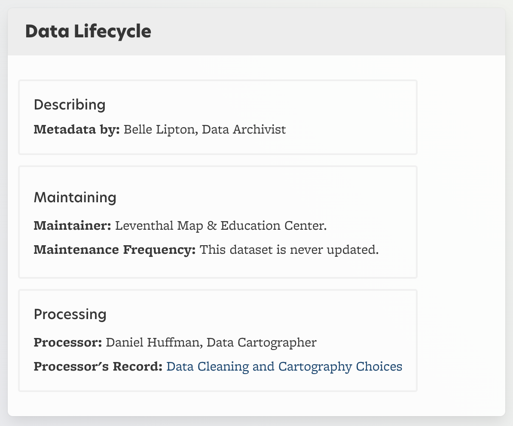

# Metadata

## Basics of metadata

* To become data detectives, we have to be readers—and writers—of metadata.
* Metadata provides information about data. Recording information about datasets is  as important as the dataset itself. Metadata helps answer questions such as
    * Who collected the data?
    * For what purpose?
    * What methods were used?
    * When did they collect the data, and when was the data last updated?
    * How was the project funded?
* This information is vital for learning how we can and cannot use a given dataset and helps us understand potential sandtraps in the data

## Where to find metadata

- On the same page as the data
- Included with the download files
- [Ask a librarian](https://www.leventhalmap.org/research/geospatial/)!

<hideable title="More details">

* **If it exists,** metadata will often be on the page where you downloaded the dataset or in a separate textfile that you get when you download the dataset itself.
* If you are making your own dataset, it is your resposibility to create and share the metadata with others! Be sure to give context to your created data so that others may use it with the correct intentions. The LMEC offers [free guides ](https://geoservices.leventhalmap.org/cartinal/guides/readme-instructions.html) on how to get started capturing good metadata in a README for data preservation and reusability

</hideable>

## Metadata on the LMEC Public Data Portal
You can find detailed metadata in the LMEC Public Data Portal. We will walk through how to understand this information using the Internet Access & connectivity dataset as an example.

### About this data

* The "About this data" section of the page includes an overview or description of the dataset including:
    - What **topics or themes** does the dataset address?
    - What **time period** does the dataset cover?
    - **Where** in the world does the dataset represent?
        - *Many, but not all, are of Boston!*
    - **Who** originally collected and cleaned the dataset?
    - **Why is it archived** in the LMEC portal?
* As well as other basic descriptive information like the **key attributes** and **access conditions**.

### The data lifecycle
* The data lifecycle tells you where and how people have worked with, changed or edited the data
* This section provides links to the records of those who have worked with data, describing, in their own words, their steps and choices
* You will not find this in most data portals, but we think it is important to preserve
* You can use this section to understand how the data has been shaped, and by who
* You can also use this section to repeat the steps of the original data processor, if you want

#### "Can You Trust This Data?""

* This section shows an evaluation of the dataset *and its metadata* by LMEC Data Archivist Belle Lipton.

* These evaluations aim to understand the value and limitations of the datsets that live on the portal, asking questions such as:
    * Will using this dataset cause harm to those it is mapping?
    * What is the intent behind the datasets?
* It is a unique feature of the LMEC Public Data Portal; it's not a section you'll see consistently on sites that provide datasets.
* Data documentation is increasingly important to understand where the data is coming from.

### Data transparency

* Data transparency applies not only to maps—"where does the data on that map come from"—but also to the data itself.
* Both data and metadata needs to be looked at through the lense of transparency!
* As critical viewers of data you should begin to prioritize and value ethical data transparency in order to make fair choies about what can and cannot be said from a given dataset.

## Check for Understanding

##### Wicked Free Wi-Fi, a dataset from the City of Boston on Public Wifi Spots

<Quizlet
    title="Check your understanding"
    :questions="[
        {
            text: 'Considering the dataset above, what metadata not present would make the dataset more transparent?. Choose all that apply',
            answers: [
            {text: 'The timeframe in which the data was collected' },
            {text: 'How the cartographer worked with the data', correct: true},
            {text: 'The name of the dataset'},
            {text: 'Forseen limitations of using the datset', correct: true}
        ]},

        {text: 'Once collected, data is not altered by humans in any form.',
        answers: [
            {text: 'True'},
            {text: 'False',correct: true}
        ]
        },
        
         {text: 'In mapping internet access in Boston, which of the following does the metadata help you understand',
        answers: [
            {text: 'Which organization collected this data', correct:true},
            {text: 'Internet Access in souther Massachusetts'},
            {text: 'The quality of the WiFi offered'}
        ]
        }
    ]"
/>
