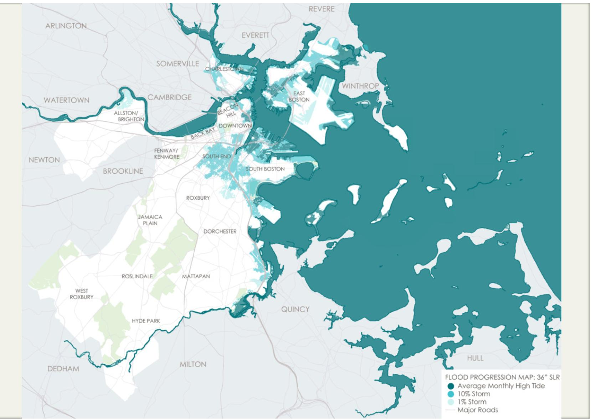
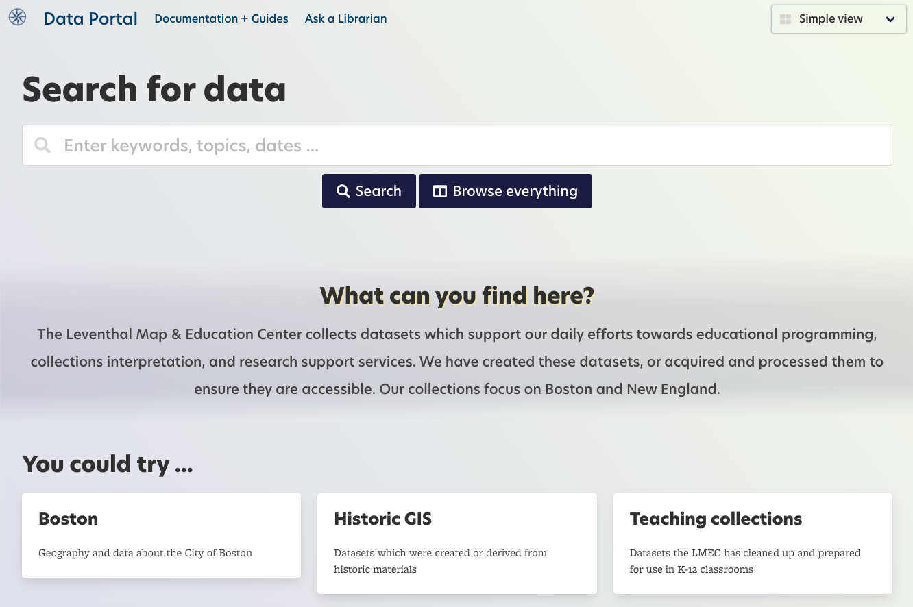

# Learning to question data

## In between the world and data are people

* Just as there's a human behind every map, there is a human behind every dataset. This person chooses how to observe the world, how to organize these observations, and how to share the dataset with the world.

<aside>

"Privilege hazard" is a term developed by Catherine D'Ignazio and Lauren Klein in their book *Data Feminism*. The whole chapter on power is useful in learning to critically question data.  You can read it [here](https://data-feminism.mitpress.mit.edu/pub/vi8obxh7/release/3)!

</aside>

* Because there are humans in data, data is exposed to human error, oversight, and bias.
* The concept of a "privilege hazard" captures the oversights that occur when perspectives of those in power "exert an outsized influence on the decisions being made" with a given dataset, often "to the exclusion of other perspectives."  

<figure>

<figcaption>

An illustration of the human role in data collection, Tess McCann (2021).

</figcaption>
</figure>

<Hideable title = "Read more about privilege hazard">

In their book *Data Feminism*, Catherine D'Ignazio and Lauren Klein describe "privilege hazard" as the following:
> "When data teams are primarily composed of people from dominant groups, those perspectives come to exert outsized influence on the decisions being made—to the exclusion of other identities and perspectives. This is not usually intentional; it comes from the ignorance of being on top. We describe this deficiency as a privilege hazard."

Inherent in this definition is a question of *power*. Power is expressed in data science and mapping all the time and at every stage of the data collection, analysis, cartographic design, and production process. Power is at the heart of critical questions we pose of data. Answering these questions shines a light on where power is lurking in seemingly benign objects like maps.   

</Hideable>

## What questions should we ask of data?

* To start to understand the human element in every dataset, we can pose questions like these:  
    * **Who** made the data?
    * **Why** was this data collected? What is the dataset's agenda? Personal bias of the data collectors can easily skew data to tell one side of the story but not the other.
    * **When** was the data collected? Can the data still be used to make accurate conclusions?
    * **What** is being counted or recorded? What is *not* being counted? What does this imply about the dataset?
    * **Where** is the region that this data covers? Where was the data collected?

## Changing spaces, changing data

* Both attribute and feature data can be critically questioned in this way.
* The world around us is constantly changing; we must keep datasets updated. We must continue to ask questions of the data.
*  Open Street Map and crowdsourced platforms offer ways for the general public to update spatial data, but who feels empowered to partake in these mappings and remappings? Does everyone have equal access?  
* One example of changing feature data is rising sea levels. Data that describes the coastline has to be updated frequently, and old files might be inaccurate.

<figure>

 

 <figcaption>

Flood Progression Map: 2070 and Beyond, Leventhal Map and Education Center (2016).

</figcaption>
</figure>

<hideable title = "Read more about changing spaces">

It is more straightforward to imagine attribute data changing (ex. the population in a region increases) than feature data changing. However, it is still important to ask questions of the feature data - the *where* data. Remember that feature data include streets, country borders, townlines and other physical elements of the world. Can these physical elements around us change?

The simple answer is: yes! And we can recognize this in our own lifetimes: street locations, national borders, and boundaries are constantly changing. Climate change presents a particularly stark example. Data that represents the coastline from five years ago is simply out of date. Because of rising sea levels, today's coastline is significantly different than the coastline that the old data represents. Spatial data also needs constant maintenance to stay up to date. We need to ask the same questions of it as we do of attribute data: who, what, where, when, why, and how. We can see this idea reflected in the LMEC's work to [map the effects of climate change in Boston](https://collections.leventhalmap.org/map-sets/191).  In this map we see how rising sea levels and floods may change the geography of the city and what areas are above water.

Another example of how spatial data should be questioned is regarding politically recognized borders and or regions. If one entity - such as a country - does not legally recognize the rights of a certain people or group, their datasets may not reflect the existence of such boundaries.

[Open Street Map](https://www.openstreetmap.org/#map=5/38.007/-95.844) or OSM for short, is an open source map project created and maintained by the public is a great example of how datasets can be changing and evolving over time. Users can add in polygons, points, and lines to update the world around them. This collective approach might feel refreshing, but even seemingly democratic platforms can perpetuate oppressive power structures. In the case of OSM, those with the time and resources to contribute are not representative of the world the project aims to describe, and the site continues to undergo controversy regarding who is contributing and for what purposes.

</hideable>

## Introduction to the LMEC Public Data Portal

* In the next sessions, we will dive into the [Leventhal Map and Education Center's Public Data Portal](data.leventhalmap.org).
* It offers curated Boston-centric datasets along with a variety of other resources to kickstart your mapping adventures!
* It includes robust information about the datasets it houses. This information helps us answer the critical questions we've discussed today.

<figure>

<figcaption>

Data Portal homepage, Leventhal Map and Education Center (2021).

</figcaption>

</figure>

<Quizlet
    title="Check your understanding"
    :questions="[
        {text: 'Datasets never have to be updated or altered; once they\'re made, they remain accurate for all time.',
        answers: [
            {text: 'True'},
            {text: 'False', correct: true}
        ]},
        {text: 'Computers can update data automatically, without human input.',
        answers: [
            {text: 'True'},
            {text: 'False', correct: true}
        ]
        }
    ]"
/>
