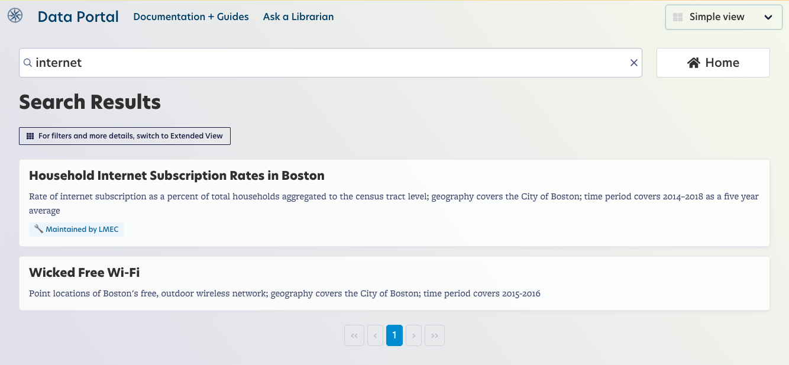
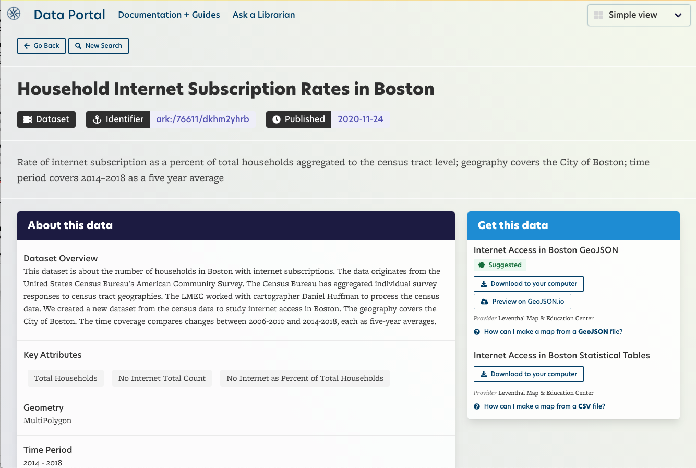
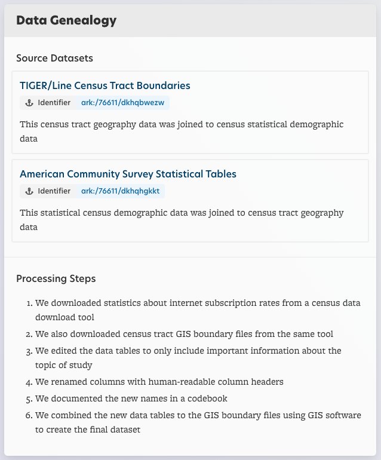

# Introducing the LMEC Public Data Portal

## Overview

* The **[LMEC Public Data Portal](https://data.leventhalmap.org/#/)** houses a variety of datasets drawn from numerous data sources
* This search tool expands the usefulness of these data sources by offering a more detailed information than is commonly available about:
    - **where** the data came from,
    - **how** it has evolved over time,
    - **who** has changed or edited it,
    - and how **easy** it is for people to use
* Information about data is called **metadata**, and it is integral to understanding how to work with a dataset
* You might not always be able to find *as* detailed information as is available with the LMEC portal, but no matter which data retrieval site you are using, you will need to know how to work with metadata

## Searching the Data Portal

* When you first enter the data portal you will see this search screen.

<figure>

<figcaption>

A screenshot of the LMEC Public Data Portal homepage, LMEC (2021).

</figcaption>

</figure>

* Let's try searching for the Boston internet access data we were looking at in the last Session. Enter a key word, such as "internet," that relate to the topic you want to find.

<figure>

<figcaption>

A screenshot of the LMEC Public Data Portal search results page, LMEC (2021).

</figcaption>

</figure>

* When you see the result you want to explore, click on the data to be taken to the main page for the data source. Here you can see various information about the data being collected including authors, sources, curators, and more. This is metadata, which we'll dive into in Session 3.

<figure>

<figcaption>

A screenshot of the LMEC Public Data Portal dataset download page, LMEC (2021).

</figcaption>
</figure>

## Data Geneology
* The **Data Geneology** section on the Data Portal traces the data lineage of a dataset
* Was it combined from other sources? Joined like how we learned in Session 2?
* Processing steps are provided so you could retrace the steps

<figure>

<figcaption>

A screenshot of the Data Geneology section of the dataset download page, LMEC (2021).

</figcaption>

</figure>

<hideable title = "Learn more: cleaning data">

Often when making a map, data needs to be changed and adapted to fit the user's need. This is called **data cleaning** and is an important step in all mapping projects. Because this introduces the element of humans manipulating the original data, it is important to document what changes and steps were made to get to the dataset as presented. Many times this information is not included but here in the LMEC Data Portal we can clearly follow how the dataset was made.

</hideable>

## Comprehension check
What do you notice about the two Source Datasets listed in the Data Geneology for the internet access dataset? Can you recognize feature and attribute data? How do you think this spatial and attribute data were combined into one?

<hideable title = "Check your answer">

You probably guessed it: a join! Joining is a common data processing step that allows us to give attribute data spatial significance so we can understand how the information is spread out.

</hideable>
