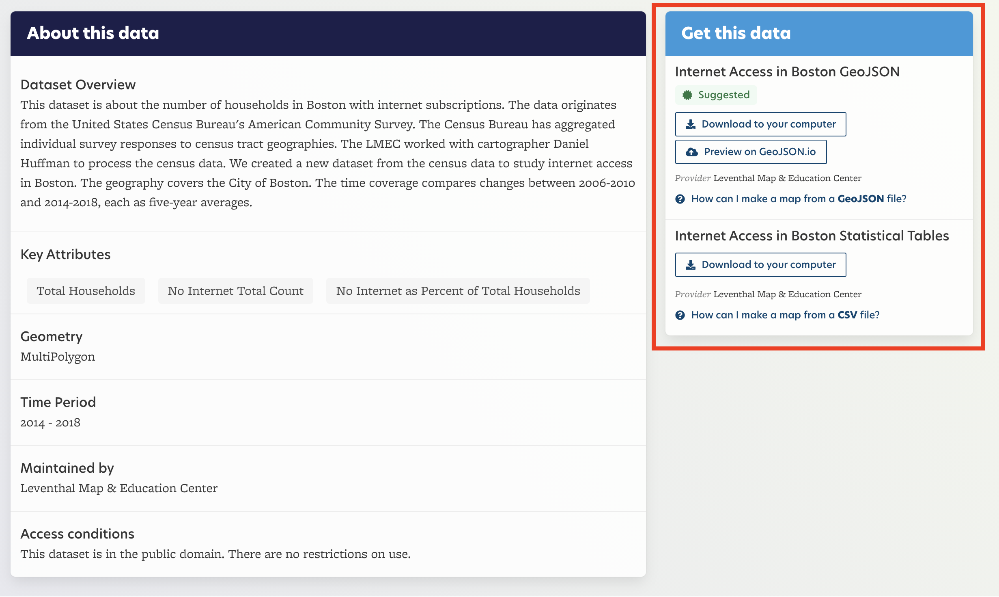
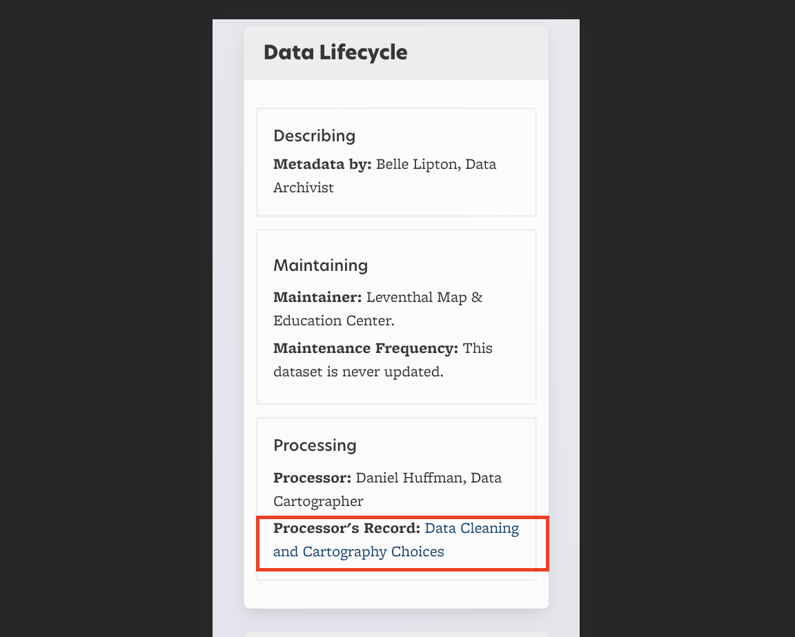
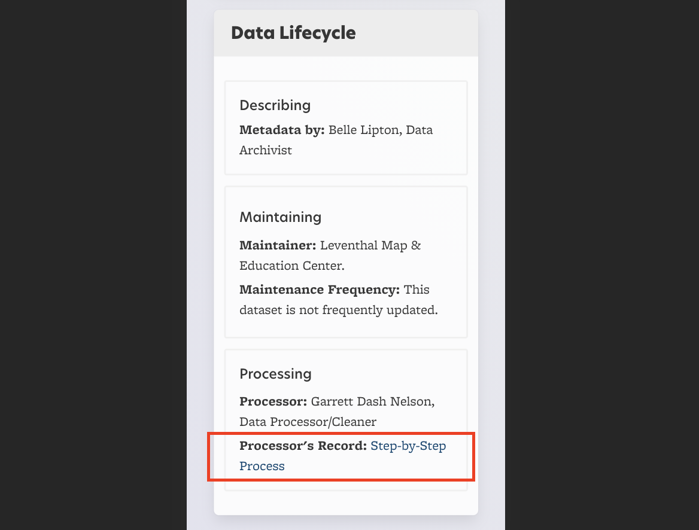
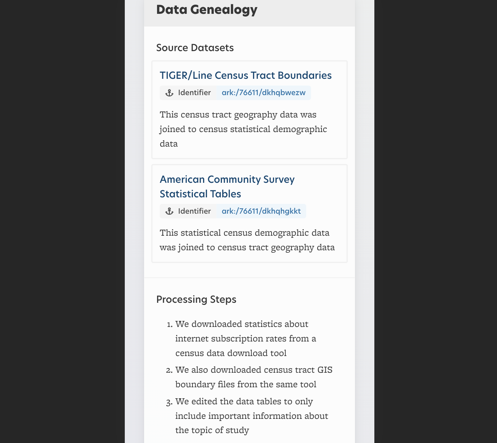
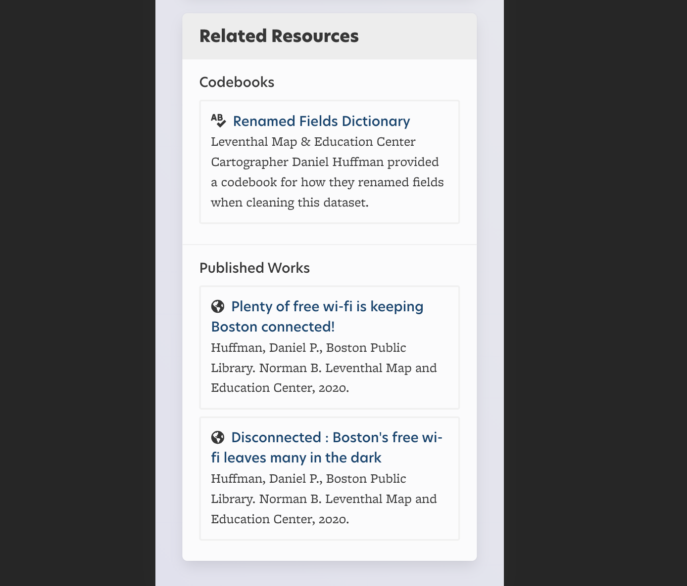

# Metadata on the LMEC Public Data Portal

You can find detailed metadata in the LMEC Public Data Portal. We will walk through how to understand this information using the Internet Access & Connectivity dataset as an example.

## About This Data

**Problem:** Sometimes you just want some quick facts at a glance about a dataset, without having to download or open the data.

**Solution:** The "About This Data" section of the page includes an overview or description of the dataset. It includes:
- What **topics or themes** does the dataset address?
- What **time period** does the dataset cover?
- **Where** in the world does the dataset represent?
    - *Many, but not all, are of Boston!*
- **Who** originally collected and cleaned the dataset?
- **Why is it archived** in the LMEC portal?

As well as other basic descriptive information like the **key attributes** and **access conditions**.

#### Example

<figure>

<figcaption>

"About this data" example, LMEC (2021).

</figcaption>

</figure>

## Get This Data

**Problem:** Sometimes it can be confusing how to get access to the "raw" data files. Sometimes you want to download the data, sometimes you want to preview it. Lots of different format options seem complicated.

**Solution:** The "Get This Data" section of the page:
- Is prominently featured to provide quick access
- Provides links to documentation on [different file formats](/guides/file-formats.html)
- Tags options as "suggested" if there are multiple formats available
- Allows for both full-access downloading, but also previewing in the browser, using geoJSON.io

#### Example 

<figure>

<figcaption>

"Get this data" example, LMEC (2021).

</figcaption>

</figure>

## The Data Lifecycle
**Problem:** It can be challenging sometimes to understand how a dataset came to be. Who manipulated it? What tools did they use? What was the reasoning behind their process?

**Solution:**
The "Data Lifecycle" section of the page provides links to the records of those who have worked with data, describing, in their own words, their steps and choices

You will not find this information in most data portals. It is an excellent way to understand how the data has been shaped, and by whom. You can also use this section to reproduce the steps of the original data processor, if necessary.

#### Example 1

<figure>

<figcaption>

"Data Cleaning and Cartography Choices" example, LMEC (2021).

</figcaption>

</figure>

#### Example 2 

<figure>

<figcaption>

"Step-by-Step Process" example, LMEC (2021).

</figcaption>

</figure>

## Data Genealogy 

**Problem:** It can sometimes be challenging to understand how a dataset came to be. Was it derived or combined from other data sources?

**Solution:** The "Data Genealogy" section of the page:
- Links to all source datasets
- Provides a step-by-step breakdown of how the dataset was created

#### Example

<figure>

<figcaption>

"Data Geneology" example, LMEC (2021).

</figcaption>

</figure>

## Related Resources

**Problem:** Datasets alone, without context, are hard to use. A lot of the time, there are useful supplementary resources that can help us understand more about a dataset.

**Solution:** The "Related Resources" section of the page links out to helpful:
- Documentation
- Codebooks
- Articles
- Blog posts
- Other publications
- Supplementary files
- Maps made from the data
- And more...

#### Example

<figure>

<figcpation>

"Related Resources" example, LMEC (2021).

</figcaption>

</figure>

## Considerations

**Problem:** Sometimes, even when factual information is available about a dataset, it can still be difficult to make sense of the dataset's usefulness to your question or project.

**Solution:** The "Considerations" section of the page give you clues about:
- How well this dataset has been described so that people can understand it
- How easily compatible with GIS software and other computer programs the dataset is
- How thorough the documentation is in describing the dataset's social context

::: tip
For more information about this process check out  [considerations documentation](/documentation/schema/considerations.html).
:::

#### Example

<figure>

<figcaption>

"Considerations" example, LMEC (2021).

</figcaption>

</figure>

