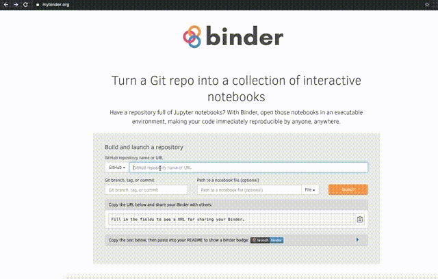
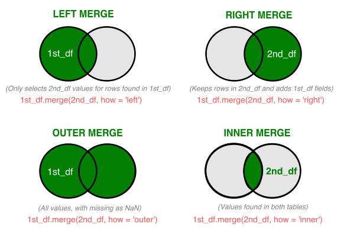
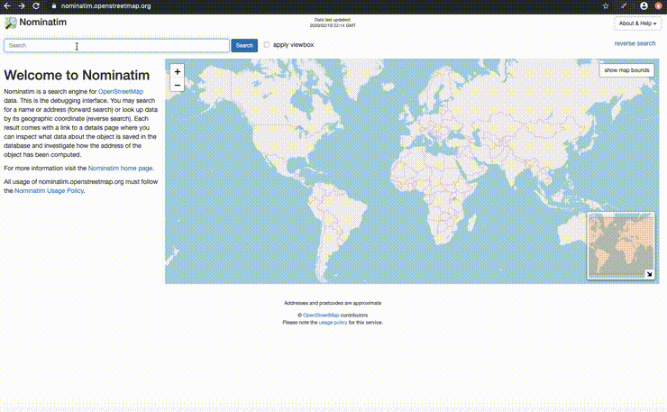

# Basic Mapmaking in Python 

## Background Information

This guide was written to accompany an in-person workshop taught at the Leventhal Map and Education Center at the Boston Public Library (winter 2019-2020). It was developed by Brian Kominick and Victoria Mak, both GIS & Public Service interns at Map Center at the time this guide was written. 

Here, you will find workshop code exercises. These exercises are geared towards introducing the Python programming language for **creating maps using code**, rather than a visual software interface like QGIS. It is also focused on providing examples for collecting and **cleaning data sets** from the web. 


These workshop are prepared as Jupyter notebooks you can run in the browser using MyBinder. 

::: tip Jupyter and Binder
New to these tools? Check out our guide on [Understanding Jupyter and Binder]("./jupyter-binder.html")
:::

 Follow the steps below to launch one of the github repositories in a virtual environment.  If you're not familiar with Python or Jupyter, try starting out with basics.ipynb.




1. Navigate to [MyBinder](https://mybinder.org/)  
2. Paste one of the links to the repositories listed below ([Workshop Notebooks](#Workshop-Notebooks )) into the first box `GitHub repository name or URL`  
3. Click the orange `Launch` button and wait for the docker image to build

## Workshop Notebooks   
To work through the full learning activity, open any of the repositories below in [MyBinder](https://mybinder.org)  
[Python Basics]()  
Heatmap: [https://github.com/brankominick/Leaflet-maps](https://github.com/brankominick/Leaflet-maps)  
Data Cleaning with Maps: [https://github.com/viymak/data-cleaning-python-workshop](https://github.com/viymak/data-cleaning-python-workshop)  

## Workshop Modules

*For quick reference, you can find the functions explored in the workshop here:*

### Filtering Data
<!-- tabs:start -->
**Example**
<iframe src="https://trinket.io/embed/python3/5e0293c6ca" width="100%" height="356" frameborder="0" marginwidth="0" marginheight="0" allowfullscreen></iframe>
<strong>Challenge</strong>
<iframe src="https://trinket.io/embed/python3/ae9fec2bd8" width="100%" height="356" frameborder="0" marginwidth="0" marginheight="0" allowfullscreen></iframe>
<strong>Answer</strong>
<iframe src="https://trinket.io/embed/python3/c3cdf66ee7" width="100%" height="356" frameborder="0" marginwidth="0" marginheight="0" allowfullscreen></iframe>
<!-- tabs:end -->


### Removing Data
<!-- tabs:start -->
<strong>Example</strong>

<iframe src="https://trinket.io/embed/python3/ef3084867c" width="100%" height="356" frameborder="0" marginwidth="0" marginheight="0" allowfullscreen></iframe>

<strong>Challenge</strong>
<iframe src="https://trinket.io/embed/python3/baf9d8e5f1" width="100%" height="356" frameborder="0" marginwidth="0" marginheight="0" allowfullscreen></iframe>
<strong>Answer</strong>
<iframe src="https://trinket.io/embed/python3/59534fbf82" width="100%" height="356" frameborder="0" marginwidth="0" marginheight="0" allowfullscreen></iframe>
<!-- tabs:end -->


### Merging Data

<!-- tabs:start -->
<strong>Example</strong>
<iframe src="https://trinket.io/embed/python3/bca707d2f4" width="100%" height="356" frameborder="0" marginwidth="0" marginheight="0" allowfullscreen></iframe>
<strong>Challenge</strong>
<iframe src="https://trinket.io/embed/python3/06e5542706" width="100%" height="356" frameborder="0" marginwidth="0" marginheight="0" allowfullscreen></iframe>
<strong>Answer</strong>
<iframe src="https://trinket.io/embed/python3/fd8b823427" width="100%" height="356" frameborder="0" marginwidth="0" marginheight="0" allowfullscreen></iframe>
<!-- tabs:end -->

### Nominatim


We will use:
- [Nominatim](https://nominatim.openstreetmap.org/) is a free search engine for OpenStreetMap data.  Review the [usage policy](https://operations.osmfoundation.org/policies/nominatim/) for limits.
- [GeoPy](https://geopy.readthedocs.io/en/stable/) allows you to easily use third party geocoders in python.

### Geocoding
*Address to geographic coordinates*  
*Often, you will find that your data contains a street address without coordinates.  In order to place these points on a map, you will need to reformat these locations as latitude and longitude.*

For this example we will use a dataframe containing information about BPL's branches with addresses


<!-- tabs:start -->

<strong>Example</strong>

``` python
#Import libraries
from geopy.geocoders import Nominatim    
from geopy.extra.rate_limiter import RateLimiter #optional for our purposes  

#Create Dataframe
dictionary = {'branch': [Central Library in Copley Square,Chinatown,North End,West End], 'address': [700 Boylston Street Boston MA 02116,2 Boylston Street Boston MA 02116,25 Parmenter St Boston MA 02113,151 Cambridge St Boston MA 02114]}
bpl_branches = DataFrame(data=d)

geolocator = Nominatim(user_agent='bpl_geolocator')

#One Address
location = geolocator.geocode('Charlestown Library')
print(location.latitude, location.longitude)

```

<strong>Challenge</strong>

``` python
#Loop through Addresses
```

<strong>Answer</strong>

``` python
#Import libraries
from geopy.geocoders import Nominatim    
from geopy.extra.rate_limiter import RateLimiter

#Create geocoding function named geocode
geocode = RateLimiter(locator.geocode, min_delay_seconds=1)
```

<!-- tabs:end -->


