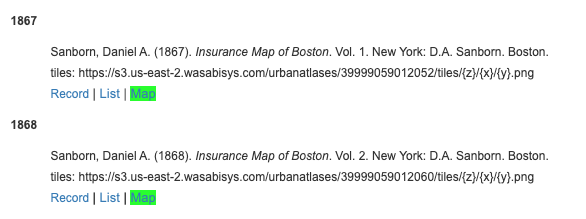
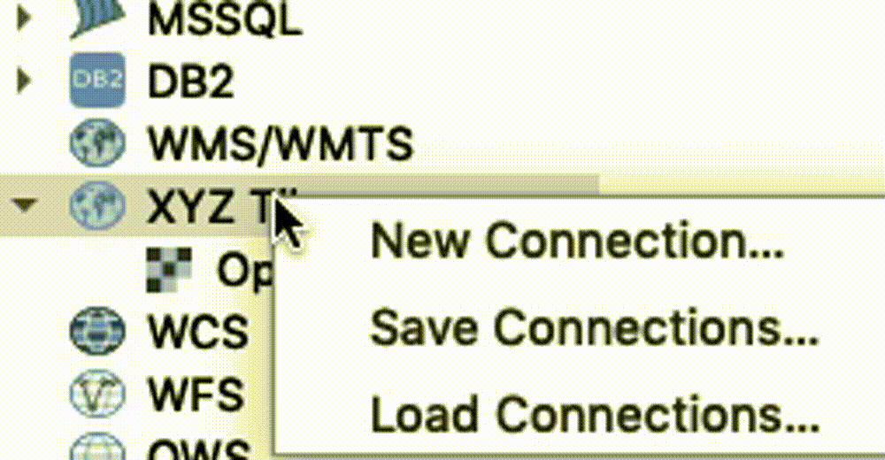

# Bring BPL Atlas Tiles into QGIS

The stitched together and hosted web tiles for each of our Boston atlases that serve as the underlying data behind our <a target = "_blank" href ='https://atlascope.leventhalmap.org/'>Atlascope project</a> can be brought into any GIS project.

We have done all the georeferencing, stitching and tiling, so you can get started using the mosaiced tiles as GIS layers in your project. This guide will walk through some of the ways to get started using tiles in your project. 

## Ways to use our atlas tiles
- As basemaps 
- Compare between different years
- Create your own inferred data by digitizing features and creating point, line and polygon datasets from the historical imagery
- Combine inferred data from atlas layers with other datasets to tell stories or do analysis

## Available atlas layers
For a complete list and details on how to access the underlying Atlascope data, visit our <a target = "_blank" href ='https://geoservices.leventhalmap.org/cartinal/resources/documentation/access-urban-atlas-data.html'>Use Digitized Urban Atlases as GIS Source Data documentation.</a>

Citations for all BPL urban atlases including tile links are also available in our <a target = "_blank" href ='https://guides.bpl.org/urban-atlases/list'>List of urban atlases libguide.</a>

::: tip Example libguide citations

:::

## Finding layers by geography

The best way to find available layers by geography is to use <a target = "_blank" href ='https://atlascope.leventhalmap.org/'>Atlascope.</a>

Zoom in to a location in Atlascope, and the menus will update with every atlas we have available for that precise location. 

Engage with the year layer you are interested in by turning it on in the menu, and clicking `About this map`

At the bottom of each layer's `About this map` page is a link to the tile endpoint.

::: tip Example Atlascope layer tile link

:::


## Using with Software

### QGIS

1. Copy the URL to the atlas layer you want to use by <a target = "_blank" href ='./resources/documentation/access-urban-atlas-data.html'>referencing the documentation</a>, <a href ='./atlascope-tiles.html#Finding-layers-by-geography'>searching in Atlascope</a>, or <a target = "_blank" href ='https://guides.bpl.org/urban-atlases/list'>using our library guides.</a>

2. Open <a target = "_blank" href ='./resources/guides/download-qgis.html'>QGIS</a>. 

3. To get a reference map of real-life geography, in the Browser, which can be toggled on under `View → Panels → Browser`, expand XYZ Tiles and double click OpenStreetMap


5. Zoom in on the basemap in the map document to the area of interest. In this example, we will be using Somerville, MA. 


4. To add the historical atlas layer, in the `Browser panel`, right-click on `XYZ tiles` and select `New Connection`

::: tip XYZ Tiles → New Connection

:::

5. Enter the following settings

::: tip New XYZ Tile Connection Settings<br>
**Name:** Whatever you want the atlas layer to be called in your map document. Geography and year could be a good name, for instance, "Somerville 1895"<br><br>
**URL:** The URL you copied for the tile endpoint<br><br>
```
https://s3.us-east-2.wasabisys.com/urbanatlases/{volume-identifier}/tiles/{z}/{x}/{-y}.png
```
<br>

**Min. Zoom Level:** 13<br><br>
**Max. Zoom Level:** 20<br><br>
Everything else default<br>
:::


6. You will now see your new tile layer as an option in the `browser` under `XYZ Tiles`. Double-click the new layer to add it to the document.


You can now use this layer as a basemap. You can bring in other datasets to compare it to, like other historical layers, or modern data. Alternatively, in QGIS you can use this historical layer to create your own point, line or polygon dataset by digitizing features from the historical basemap and adding attribute information to those features. 


### ArcGIS Online

ArcGIS Online (AGOL) is one of the more popular out-of-the-box web mapping tools. With it, users can make free online web maps from many different data sources.

AGOL does allow one to bring in XYZ tilesets to display in a shareable web map. Unfortunately, AGOL does not accommodate the TMS specification our tiles were initially created in, it only allows for the XYZ specification. We are in the process of translating our Boston tiles to the XYZ pyramid schema, in order to ensure compatibility with this popular tool. While this transition process is underway, if there are particular layers you are interested in working with right now in ArcGIS Online, please <a target = "_blank" href ='https://geoservices.leventhalmap.org/cartinal/resources/request.html'>let us know</a>, and we will prioritize these tilelayers and get them formatted for you in a speedy manner. To inquire about the schema specifications for any given atlas volume, please consult our <a target = "_blank" href ='./resources/documentation/access-urban-atlas-data.html'>documentation</a>, or drop us a line.


### Leaflet

If you are planning to use a Boston atlas which has not yet been converted from the TMS pyramid specification to the XYZ specification, please note that Leaflet does not accept the -y parameter, and you will need to format the tile definition in Leaflet in the following way, by adding the `tms: true` flag.

``` javascript
L.tileLayer(
    'https://s3.us-east-2.wasabisys.com/urbanatlases/39999059015998/tiles/{z}/{x}/{y}.png', {
        tms: true, 
        attribution: 'Leventhal Map & Education Center'
    }
);
```