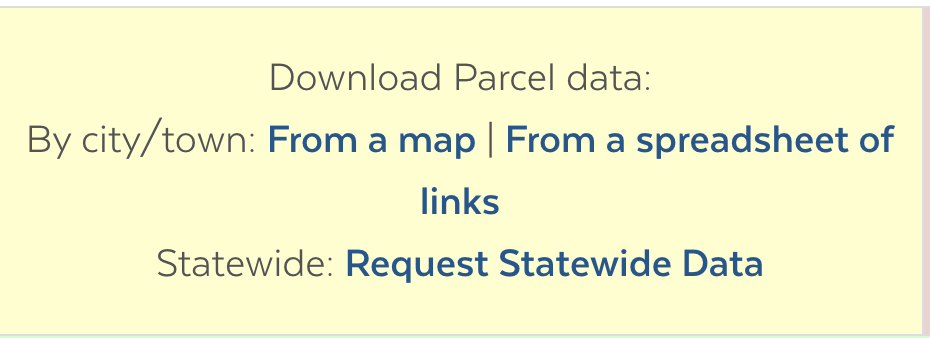
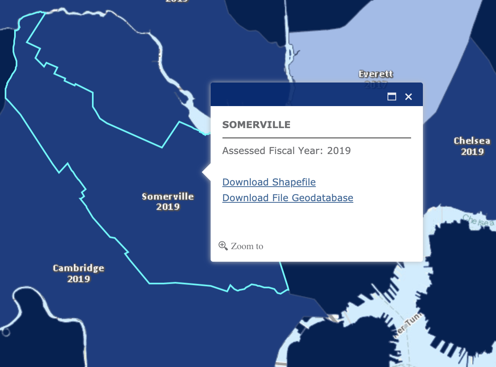
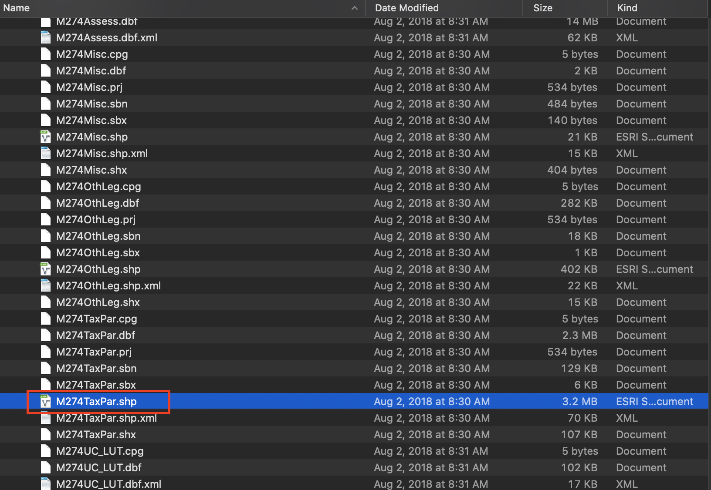
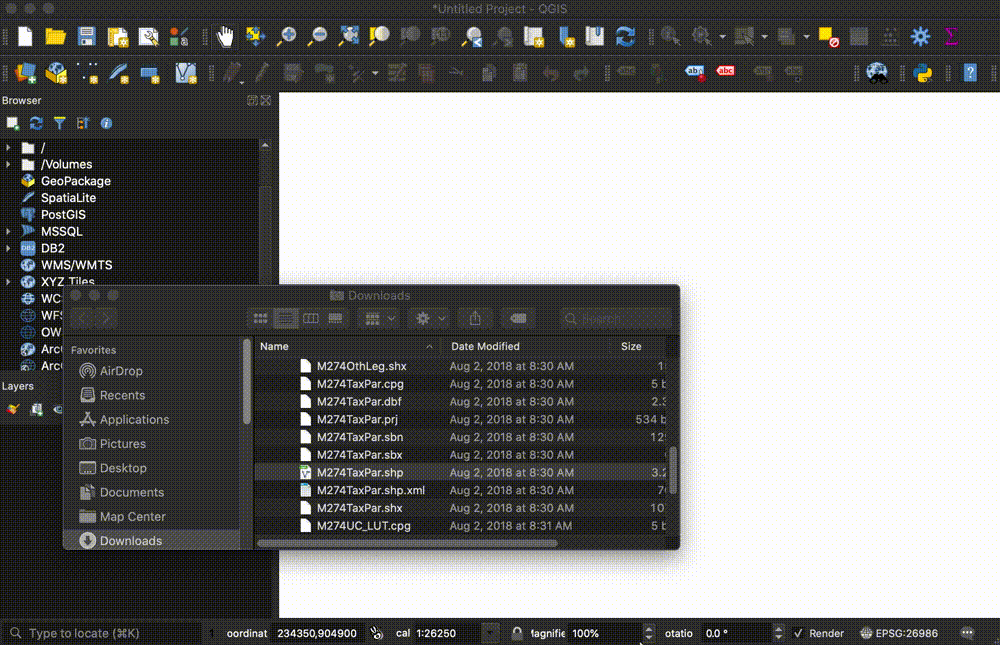

# Downloading Massachusetts Parcels

## Finding by location

Each Massachusetts municipality creates and maintains their own property boundary files. MassGIS has worked to standardize these files across municipalities. 

To learn more about this dataset and access the data codebook, please find <a target = "_blank" href ='https://docs.digital.mass.gov/dataset/massgis-data-standardized-assessors-parcels'>MassGIS Data: Standardized Assessors' Parcels</a>

To find the correct download file by location, select the `From a Map` option.

You will be taken to a web app where you are presented with a data layer showing every municipality in Massachusetts.

Each boundary will be labeled with the town or city name, and the most recent year that town or city's data was contributed to the standardized, open MassGIS dataset.

Zoom in to the area of interest, and select the city or town by clicking on the appropriate polygon.

## Downloading

Select `Download Shapefile` and unzip / extract the download.

::: danger
The data inside this data folder, when unzipped will look very messy and confusing. If you are new to working with shapefiles, it may be helpful to read our <a target = "_blank" href ='https://docs.digital.mass.gov/dataset/massgis-data-standardized-assessors-parcels'>Common GIS File Formats: Shapefile Guide</a> first.
:::

## Bringing into QGIS

In an attempt to standardize the way this data is compiled across multiple municipalities, MassGIS has broken the data in to three different layers: `Miscelleous Features`, `Other Legal Interests`, and `Tax Parcels`. 

We are interested in the `Tax Parcels` layer, but all of the different extensions of all three shapefiles will be bunched together in your data download. You will have to sort through the files to find one that ends in `TaxPar.shp`.

Drag `TaxPar.shp` into the QGIS map document. 

::: tip Correct file

:::

::: tip Bringing the file into QGIS

:::

## Interpreting the data

- To get information about any feature, you can use the <a target = "_blank" href ='https://docs.qgis.org/2.8/en/docs/user_manual/introduction/general_tools.html#:~:text=Identify%20features&text=icon%20in%20the%20toolbar.,followed%20by%20the%20layer%20name.'>QGIS Identify Tool</a>.

- To view the attribute table for the whole dataset, you can use the <a target = "_blank" href ='https://docs.qgis.org/2.18/en/docs/user_manual/working_with_vector/attribute_table.html'>QGIS Attribute Table</a>.

- To learn how to interpret field names in the attribute table, and learn more about the particulars of this dataset, visit <a target = "_blank" href ='https://docs.digital.mass.gov/dataset/massgis-data-standardized-assessors-parcels'>MassGIS Data: Standardized Assessors' Parcels</a>.